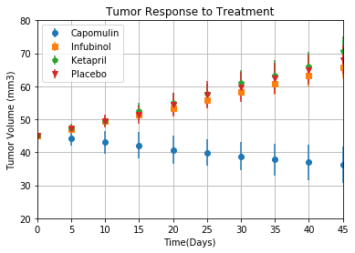

```python
#import dependencies
import pandas as pd
import csv
import numpy as np
import matplotlib.pyplot as plt
import seaborn as sb


```


```python
#load csv files
csv_path1="raw_data/clinicaltrial_data.csv"
csv_path2="raw_data/mouse_drug_data.csv"

#read csv files
path1=pd.read_csv(csv_path1)
path2=pd.read_csv(csv_path2)

#incorporate files into dataframes
clinical_trial=pd.DataFrame(path1)
mouse_drug=pd.DataFrame(path2)

#clinical_trial.head()
#mouse_drug.head()

#merge datasets
combined_data=pd.merge(clinical_trial,mouse_drug,how="outer",on="Mouse ID")
combined_data
```


<div>
<style>
    .dataframe thead tr:only-child th {
        text-align: right;
    }

    .dataframe thead th {
        text-align: left;
    }

    .dataframe tbody tr th {
        vertical-align: top;
    }
</style>
<table border="1" class="dataframe">
  <thead>
    <tr style="text-align: right;">
      <th></th>
      <th>Mouse ID</th>
      <th>Timepoint</th>
      <th>Tumor Volume (mm3)</th>
      <th>Metastatic Sites</th>
      <th>Drug</th>
    </tr>
  </thead>
  <tbody>
    <tr>
      <th>0</th>
      <td>b128</td>
      <td>0</td>
      <td>45.000000</td>
      <td>0</td>
      <td>Capomulin</td>
    </tr>
    <tr>
      <th>1</th>
      <td>b128</td>
      <td>5</td>
      <td>45.651331</td>
      <td>0</td>
      <td>Capomulin</td>
    </tr>
    <tr>
      <th>2</th>
      <td>b128</td>
      <td>10</td>
      <td>43.270852</td>
      <td>0</td>
      <td>Capomulin</td>
    </tr>
    <tr>
      <th>3</th>
      <td>b128</td>
      <td>15</td>
      <td>43.784893</td>
      <td>0</td>
      <td>Capomulin</td>
    </tr>
    <tr>
      <th>4</th>
      <td>b128</td>
      <td>20</td>
      <td>42.731552</td>
      <td>0</td>
      <td>Capomulin</td>
    </tr>
    <tr>
      <th>5</th>
      <td>b128</td>
      <td>25</td>
      <td>43.262145</td>
      <td>1</td>
      <td>Capomulin</td>
    </tr>
    <tr>
      <th>6</th>
      <td>b128</td>
      <td>30</td>
      <td>40.605335</td>
      <td>1</td>
      <td>Capomulin</td>
    </tr>
    <tr>
      <th>7</th>
      <td>b128</td>
      <td>35</td>
      <td>37.967644</td>
      <td>1</td>
      <td>Capomulin</td>
    </tr>
    <tr>
      <th>8</th>
      <td>b128</td>
      <td>40</td>
      <td>38.379726</td>
      <td>2</td>
      <td>Capomulin</td>
    </tr>
    <tr>
      <th>9</th>
      <td>b128</td>
      <td>45</td>
      <td>38.982878</td>
      <td>2</td>
      <td>Capomulin</td>
    </tr>
    <tr>
      <th>10</th>
      <td>f932</td>
      <td>0</td>
      <td>45.000000</td>
      <td>0</td>
      <td>Ketapril</td>
    </tr>
    <tr>
      <th>11</th>
      <td>g107</td>
      <td>0</td>
      <td>45.000000</td>
      <td>0</td>
      <td>Ketapril</td>
    </tr>
    <tr>
      <th>12</th>
      <td>g107</td>
      <td>5</td>
      <td>48.791665</td>
      <td>0</td>
      <td>Ketapril</td>
    </tr>
    <tr>
      <th>13</th>
      <td>g107</td>
      <td>10</td>
      <td>53.435987</td>
      <td>0</td>
      <td>Ketapril</td>
    </tr>
    <tr>
      <th>14</th>
      <td>g107</td>
      <td>15</td>
      <td>58.135545</td>
      <td>0</td>
      <td>Ketapril</td>
    </tr>
    <tr>
      <th>15</th>
      <td>g107</td>
      <td>20</td>
      <td>62.706031</td>
      <td>0</td>
      <td>Ketapril</td>
    </tr>
    <tr>
      <th>16</th>
      <td>g107</td>
      <td>25</td>
      <td>64.663626</td>
      <td>0</td>
      <td>Ketapril</td>
    </tr>
    <tr>
      <th>17</th>
      <td>g107</td>
      <td>30</td>
      <td>69.160520</td>
      <td>0</td>
      <td>Ketapril</td>
    </tr>
    <tr>
      <th>18</th>
      <td>g107</td>
      <td>35</td>
      <td>71.905117</td>
      <td>0</td>
      <td>Ketapril</td>
    </tr>
    <tr>
      <th>19</th>
      <td>a457</td>
      <td>0</td>
      <td>45.000000</td>
      <td>0</td>
      <td>Ketapril</td>
    </tr>
    <tr>
      <th>20</th>
      <td>a457</td>
      <td>5</td>
      <td>47.462891</td>
      <td>0</td>
      <td>Ketapril</td>
    </tr>
    <tr>
      <th>21</th>
      <td>a457</td>
      <td>10</td>
      <td>49.783419</td>
      <td>0</td>
      <td>Ketapril</td>
    </tr>
    <tr>
      <th>22</th>
      <td>c819</td>
      <td>0</td>
      <td>45.000000</td>
      <td>0</td>
      <td>Ketapril</td>
    </tr>
    <tr>
      <th>23</th>
      <td>c819</td>
      <td>5</td>
      <td>45.769249</td>
      <td>1</td>
      <td>Ketapril</td>
    </tr>
    <tr>
      <th>24</th>
      <td>c819</td>
      <td>10</td>
      <td>46.658395</td>
      <td>1</td>
      <td>Ketapril</td>
    </tr>
    <tr>
      <th>25</th>
      <td>c819</td>
      <td>15</td>
      <td>48.370999</td>
      <td>1</td>
      <td>Ketapril</td>
    </tr>
    <tr>
      <th>26</th>
      <td>c819</td>
      <td>20</td>
      <td>49.762415</td>
      <td>1</td>
      <td>Ketapril</td>
    </tr>
    <tr>
      <th>27</th>
      <td>c819</td>
      <td>25</td>
      <td>51.828357</td>
      <td>1</td>
      <td>Ketapril</td>
    </tr>
    <tr>
      <th>28</th>
      <td>c819</td>
      <td>30</td>
      <td>56.098998</td>
      <td>1</td>
      <td>Ketapril</td>
    </tr>
    <tr>
      <th>29</th>
      <td>c819</td>
      <td>35</td>
      <td>57.729535</td>
      <td>1</td>
      <td>Ketapril</td>
    </tr>
    <tr>
      <th>...</th>
      <td>...</td>
      <td>...</td>
      <td>...</td>
      <td>...</td>
      <td>...</td>
    </tr>
    <tr>
      <th>1876</th>
      <td>i557</td>
      <td>25</td>
      <td>44.596219</td>
      <td>0</td>
      <td>Capomulin</td>
    </tr>
    <tr>
      <th>1877</th>
      <td>i557</td>
      <td>30</td>
      <td>45.261384</td>
      <td>0</td>
      <td>Capomulin</td>
    </tr>
    <tr>
      <th>1878</th>
      <td>i557</td>
      <td>35</td>
      <td>45.941949</td>
      <td>0</td>
      <td>Capomulin</td>
    </tr>
    <tr>
      <th>1879</th>
      <td>i557</td>
      <td>40</td>
      <td>46.821070</td>
      <td>1</td>
      <td>Capomulin</td>
    </tr>
    <tr>
      <th>1880</th>
      <td>i557</td>
      <td>45</td>
      <td>47.685963</td>
      <td>1</td>
      <td>Capomulin</td>
    </tr>
    <tr>
      <th>1881</th>
      <td>m957</td>
      <td>0</td>
      <td>45.000000</td>
      <td>0</td>
      <td>Capomulin</td>
    </tr>
    <tr>
      <th>1882</th>
      <td>m957</td>
      <td>5</td>
      <td>45.622381</td>
      <td>1</td>
      <td>Capomulin</td>
    </tr>
    <tr>
      <th>1883</th>
      <td>m957</td>
      <td>10</td>
      <td>46.414518</td>
      <td>1</td>
      <td>Capomulin</td>
    </tr>
    <tr>
      <th>1884</th>
      <td>m957</td>
      <td>15</td>
      <td>39.804453</td>
      <td>1</td>
      <td>Capomulin</td>
    </tr>
    <tr>
      <th>1885</th>
      <td>m957</td>
      <td>20</td>
      <td>38.909349</td>
      <td>1</td>
      <td>Capomulin</td>
    </tr>
    <tr>
      <th>1886</th>
      <td>m957</td>
      <td>25</td>
      <td>37.695432</td>
      <td>1</td>
      <td>Capomulin</td>
    </tr>
    <tr>
      <th>1887</th>
      <td>m957</td>
      <td>30</td>
      <td>38.212479</td>
      <td>1</td>
      <td>Capomulin</td>
    </tr>
    <tr>
      <th>1888</th>
      <td>m957</td>
      <td>35</td>
      <td>32.562839</td>
      <td>1</td>
      <td>Capomulin</td>
    </tr>
    <tr>
      <th>1889</th>
      <td>m957</td>
      <td>40</td>
      <td>32.947615</td>
      <td>1</td>
      <td>Capomulin</td>
    </tr>
    <tr>
      <th>1890</th>
      <td>m957</td>
      <td>45</td>
      <td>33.329098</td>
      <td>1</td>
      <td>Capomulin</td>
    </tr>
    <tr>
      <th>1891</th>
      <td>f966</td>
      <td>0</td>
      <td>45.000000</td>
      <td>0</td>
      <td>Capomulin</td>
    </tr>
    <tr>
      <th>1892</th>
      <td>f966</td>
      <td>5</td>
      <td>38.796474</td>
      <td>0</td>
      <td>Capomulin</td>
    </tr>
    <tr>
      <th>1893</th>
      <td>f966</td>
      <td>10</td>
      <td>35.624403</td>
      <td>0</td>
      <td>Capomulin</td>
    </tr>
    <tr>
      <th>1894</th>
      <td>f966</td>
      <td>15</td>
      <td>32.623003</td>
      <td>0</td>
      <td>Capomulin</td>
    </tr>
    <tr>
      <th>1895</th>
      <td>f966</td>
      <td>20</td>
      <td>30.485985</td>
      <td>0</td>
      <td>Capomulin</td>
    </tr>
    <tr>
      <th>1896</th>
      <td>m601</td>
      <td>0</td>
      <td>45.000000</td>
      <td>0</td>
      <td>Capomulin</td>
    </tr>
    <tr>
      <th>1897</th>
      <td>m601</td>
      <td>5</td>
      <td>41.408591</td>
      <td>1</td>
      <td>Capomulin</td>
    </tr>
    <tr>
      <th>1898</th>
      <td>m601</td>
      <td>10</td>
      <td>36.825367</td>
      <td>1</td>
      <td>Capomulin</td>
    </tr>
    <tr>
      <th>1899</th>
      <td>m601</td>
      <td>15</td>
      <td>35.464612</td>
      <td>1</td>
      <td>Capomulin</td>
    </tr>
    <tr>
      <th>1900</th>
      <td>m601</td>
      <td>20</td>
      <td>34.255732</td>
      <td>1</td>
      <td>Capomulin</td>
    </tr>
    <tr>
      <th>1901</th>
      <td>m601</td>
      <td>25</td>
      <td>33.118756</td>
      <td>1</td>
      <td>Capomulin</td>
    </tr>
    <tr>
      <th>1902</th>
      <td>m601</td>
      <td>30</td>
      <td>31.758275</td>
      <td>1</td>
      <td>Capomulin</td>
    </tr>
    <tr>
      <th>1903</th>
      <td>m601</td>
      <td>35</td>
      <td>30.834357</td>
      <td>1</td>
      <td>Capomulin</td>
    </tr>
    <tr>
      <th>1904</th>
      <td>m601</td>
      <td>40</td>
      <td>31.378045</td>
      <td>1</td>
      <td>Capomulin</td>
    </tr>
    <tr>
      <th>1905</th>
      <td>m601</td>
      <td>45</td>
      <td>28.430964</td>
      <td>1</td>
      <td>Capomulin</td>
    </tr>
  </tbody>
</table>
<p>1906 rows × 5 columns</p>
</div>


```python
#Tumor Response to Treatment
#group by drug and timepoint to get tumor volume and timepoint for average tumor volume
#Drug_Combined=combined_data.groupby(["Drug","Timepoint"], as_index=False)["Tumor Volume (mm3)"].mean()
Drug_Combined=combined_data.groupby(["Drug","Timepoint"]).mean()
Drug_combined_sd = combined_data.groupby(["Drug","Timepoint"]).agg(np.std,ddof=0)
Drug_combined_sd = pd.DataFrame(Drug_combined_sd)
Drug_combined_sd = pd.DataFrame(Drug_combined_sd["Tumor Volume (mm3)"])
Drug_combined_sd

#Drug_Combined =pd.DataFrame(Drug_Combined)
Drug_Combined = pd.DataFrame(Drug_Combined["Tumor Volume (mm3)"])
Drug_Combined.head()
```


<div>
<style>
    .dataframe thead tr:only-child th {
        text-align: right;
    }

    .dataframe thead th {
        text-align: left;
    }

    .dataframe tbody tr th {
        vertical-align: top;
    }
</style>
<table border="1" class="dataframe">
  <thead>
    <tr style="text-align: right;">
      <th></th>
      <th></th>
      <th>Tumor Volume (mm3)</th>
    </tr>
    <tr>
      <th>Drug</th>
      <th>Timepoint</th>
      <th></th>
    </tr>
  </thead>
  <tbody>
    <tr>
      <th rowspan="5" valign="top">Capomulin</th>
      <th>0</th>
      <td>45.000000</td>
    </tr>
    <tr>
      <th>5</th>
      <td>44.266086</td>
    </tr>
    <tr>
      <th>10</th>
      <td>43.084291</td>
    </tr>
    <tr>
      <th>15</th>
      <td>42.064317</td>
    </tr>
    <tr>
      <th>20</th>
      <td>40.716325</td>
    </tr>
  </tbody>
</table>
</div>


```python
#create a table comparing the average tumor volume for the drugs by the timepoint.
unstack_drug =Drug_Combined.unstack("Drug")
unstack_drug


```


<div>
<style>
    .dataframe thead tr:only-child th {
        text-align: right;
    }

    .dataframe thead th {
        text-align: left;
    }

    .dataframe tbody tr th {
        vertical-align: top;
    }
</style>
<table border="1" class="dataframe">
  <thead>
    <tr>
      <th></th>
      <th colspan="10" halign="left">Tumor Volume (mm3)</th>
    </tr>
    <tr>
      <th>Drug</th>
      <th>Capomulin</th>
      <th>Ceftamin</th>
      <th>Infubinol</th>
      <th>Ketapril</th>
      <th>Naftisol</th>
      <th>Placebo</th>
      <th>Propriva</th>
      <th>Ramicane</th>
      <th>Stelasyn</th>
      <th>Zoniferol</th>
    </tr>
    <tr>
      <th>Timepoint</th>
      <th></th>
      <th></th>
      <th></th>
      <th></th>
      <th></th>
      <th></th>
      <th></th>
      <th></th>
      <th></th>
      <th></th>
    </tr>
  </thead>
  <tbody>
    <tr>
      <th>0</th>
      <td>45.000000</td>
      <td>45.000000</td>
      <td>45.000000</td>
      <td>45.000000</td>
      <td>45.000000</td>
      <td>45.000000</td>
      <td>45.000000</td>
      <td>45.000000</td>
      <td>45.000000</td>
      <td>45.000000</td>
    </tr>
    <tr>
      <th>5</th>
      <td>44.266086</td>
      <td>46.503051</td>
      <td>47.062001</td>
      <td>47.389175</td>
      <td>46.796098</td>
      <td>47.125589</td>
      <td>47.248967</td>
      <td>43.944859</td>
      <td>47.527452</td>
      <td>46.851818</td>
    </tr>
    <tr>
      <th>10</th>
      <td>43.084291</td>
      <td>48.285125</td>
      <td>49.403909</td>
      <td>49.582269</td>
      <td>48.694210</td>
      <td>49.423329</td>
      <td>49.101541</td>
      <td>42.531957</td>
      <td>49.463844</td>
      <td>48.689881</td>
    </tr>
    <tr>
      <th>15</th>
      <td>42.064317</td>
      <td>50.094055</td>
      <td>51.296397</td>
      <td>52.399974</td>
      <td>50.933018</td>
      <td>51.359742</td>
      <td>51.067318</td>
      <td>41.495061</td>
      <td>51.529409</td>
      <td>50.779059</td>
    </tr>
    <tr>
      <th>20</th>
      <td>40.716325</td>
      <td>52.157049</td>
      <td>53.197691</td>
      <td>54.920935</td>
      <td>53.644087</td>
      <td>54.364417</td>
      <td>53.346737</td>
      <td>40.238325</td>
      <td>54.067395</td>
      <td>53.170334</td>
    </tr>
    <tr>
      <th>25</th>
      <td>39.939528</td>
      <td>54.287674</td>
      <td>55.715252</td>
      <td>57.678982</td>
      <td>56.731968</td>
      <td>57.482574</td>
      <td>55.504138</td>
      <td>38.974300</td>
      <td>56.166123</td>
      <td>55.432935</td>
    </tr>
    <tr>
      <th>30</th>
      <td>38.769339</td>
      <td>56.769517</td>
      <td>58.299397</td>
      <td>60.994507</td>
      <td>59.559509</td>
      <td>59.809063</td>
      <td>58.196374</td>
      <td>38.703137</td>
      <td>59.826738</td>
      <td>57.713531</td>
    </tr>
    <tr>
      <th>35</th>
      <td>37.816839</td>
      <td>58.827548</td>
      <td>60.742461</td>
      <td>63.371686</td>
      <td>62.685087</td>
      <td>62.420615</td>
      <td>60.350199</td>
      <td>37.451996</td>
      <td>62.440699</td>
      <td>60.089372</td>
    </tr>
    <tr>
      <th>40</th>
      <td>36.958001</td>
      <td>61.467895</td>
      <td>63.162824</td>
      <td>66.068580</td>
      <td>65.600754</td>
      <td>65.052675</td>
      <td>63.045537</td>
      <td>36.574081</td>
      <td>65.356386</td>
      <td>62.916692</td>
    </tr>
    <tr>
      <th>45</th>
      <td>36.236114</td>
      <td>64.132421</td>
      <td>65.755562</td>
      <td>70.662958</td>
      <td>69.265506</td>
      <td>68.084082</td>
      <td>66.258529</td>
      <td>34.955595</td>
      <td>68.438310</td>
      <td>65.960888</td>
    </tr>
  </tbody>
</table>
</div>


```python
#unstack table for SE values

SE_tumor_volume_unstack = Drug_combined_sd.unstack("Drug")
SE_tumor_volume_unstack
```


<div>
<style>
    .dataframe thead tr:only-child th {
        text-align: right;
    }

    .dataframe thead th {
        text-align: left;
    }

    .dataframe tbody tr th {
        vertical-align: top;
    }
</style>
<table border="1" class="dataframe">
  <thead>
    <tr>
      <th></th>
      <th colspan="10" halign="left">Tumor Volume (mm3)</th>
    </tr>
    <tr>
      <th>Drug</th>
      <th>Capomulin</th>
      <th>Ceftamin</th>
      <th>Infubinol</th>
      <th>Ketapril</th>
      <th>Naftisol</th>
      <th>Placebo</th>
      <th>Propriva</th>
      <th>Ramicane</th>
      <th>Stelasyn</th>
      <th>Zoniferol</th>
    </tr>
    <tr>
      <th>Timepoint</th>
      <th></th>
      <th></th>
      <th></th>
      <th></th>
      <th></th>
      <th></th>
      <th></th>
      <th></th>
      <th></th>
      <th></th>
    </tr>
  </thead>
  <tbody>
    <tr>
      <th>0</th>
      <td>0.000000</td>
      <td>0.000000</td>
      <td>0.000000</td>
      <td>0.000000</td>
      <td>0.000000</td>
      <td>0.000000</td>
      <td>0.000000</td>
      <td>0.000000</td>
      <td>0.000000</td>
      <td>0.000000</td>
    </tr>
    <tr>
      <th>5</th>
      <td>2.197647</td>
      <td>0.735688</td>
      <td>1.151761</td>
      <td>1.242109</td>
      <td>0.949271</td>
      <td>1.045927</td>
      <td>1.135133</td>
      <td>2.365989</td>
      <td>1.175081</td>
      <td>0.906174</td>
    </tr>
    <tr>
      <th>10</th>
      <td>3.442436</td>
      <td>1.029330</td>
      <td>1.262689</td>
      <td>1.637910</td>
      <td>1.428468</td>
      <td>1.928230</td>
      <td>1.764510</td>
      <td>3.454076</td>
      <td>2.034132</td>
      <td>1.209568</td>
    </tr>
    <tr>
      <th>15</th>
      <td>4.021867</td>
      <td>1.408781</td>
      <td>1.599705</td>
      <td>2.461868</td>
      <td>1.987318</td>
      <td>2.678375</td>
      <td>1.864437</td>
      <td>3.694863</td>
      <td>2.313599</td>
      <td>1.657125</td>
    </tr>
    <tr>
      <th>20</th>
      <td>4.267015</td>
      <td>1.482184</td>
      <td>2.075749</td>
      <td>3.082210</td>
      <td>2.594679</td>
      <td>3.562160</td>
      <td>2.220724</td>
      <td>3.687602</td>
      <td>2.781171</td>
      <td>2.132729</td>
    </tr>
    <tr>
      <th>25</th>
      <td>4.040192</td>
      <td>1.811512</td>
      <td>2.269005</td>
      <td>3.204945</td>
      <td>3.354998</td>
      <td>4.139488</td>
      <td>2.081850</td>
      <td>3.503701</td>
      <td>3.147711</td>
      <td>2.333522</td>
    </tr>
    <tr>
      <th>30</th>
      <td>4.282231</td>
      <td>1.900164</td>
      <td>2.524244</td>
      <td>3.851479</td>
      <td>3.649973</td>
      <td>4.558204</td>
      <td>2.584374</td>
      <td>4.056767</td>
      <td>3.708932</td>
      <td>2.993486</td>
    </tr>
    <tr>
      <th>35</th>
      <td>4.821974</td>
      <td>2.495934</td>
      <td>3.264073</td>
      <td>4.511469</td>
      <td>3.793175</td>
      <td>4.642077</td>
      <td>3.254788</td>
      <td>4.326493</td>
      <td>3.885324</td>
      <td>3.178026</td>
    </tr>
    <tr>
      <th>40</th>
      <td>5.472143</td>
      <td>2.554552</td>
      <td>3.165659</td>
      <td>4.334519</td>
      <td>4.185296</td>
      <td>4.545879</td>
      <td>4.425864</td>
      <td>4.918779</td>
      <td>4.677884</td>
      <td>3.600198</td>
    </tr>
    <tr>
      <th>45</th>
      <td>5.473794</td>
      <td>3.125859</td>
      <td>3.236929</td>
      <td>4.595379</td>
      <td>4.906426</td>
      <td>4.274532</td>
      <td>4.626071</td>
      <td>5.347519</td>
      <td>4.985508</td>
      <td>3.618444</td>
    </tr>
  </tbody>
</table>
</div>


```python
#create scatter plot for Tumor volume  to Treatment
#x_axis=np.arange(0,50,5)

#plot error bar
plt.errorbar(unstack_drug.index,unstack_drug["Tumor Volume (mm3)","Capomulin"],
             SE_tumor_volume_unstack["Tumor Volume (mm3)","Capomulin"],label= "Capomulin",fmt="o")

plt.errorbar(unstack_drug.index, unstack_drug["Tumor Volume (mm3)","Infubinol"],
            SE_tumor_volume_unstack["Tumor Volume (mm3)","Infubinol"],label="Infubinol",fmt="s")
plt.errorbar(unstack_drug.index, unstack_drug["Tumor Volume (mm3)","Ketapril"],
            SE_tumor_volume_unstack["Tumor Volume (mm3)", "Ketapril"], label = "Ketapril", fmt = "p")

plt.errorbar(unstack_drug.index, unstack_drug["Tumor Volume (mm3)", "Placebo"],
            SE_tumor_volume_unstack["Tumor Volume (mm3)", "Placebo"], label="Placebo", fmt="v")


plt.ylim(20,80)
plt.xlim(0,45)
plt.title("Tumor Response to Treatment")
plt.xlabel("Time(Days)")
plt.ylabel("Tumor Volume (mm3)")
plt.grid()
plt.legend(loc="upper left")
plt.show()

```





```python
#Metastic Response to Treatment
Met_combined=combined_data.groupby(["Drug","Timepoint"]).mean()
Met_combined = pd.DataFrame(Met_combined["Metastatic Sites"])

#create a table comparing the average metastic sites for the drugs by the timepoint.
unstack_met=Met_combined.unstack("Drug")
unstack_met
```


<div>
<style>
    .dataframe thead tr:only-child th {
        text-align: right;
    }

    .dataframe thead th {
        text-align: left;
    }

    .dataframe tbody tr th {
        vertical-align: top;
    }
</style>
<table border="1" class="dataframe">
  <thead>
    <tr>
      <th></th>
      <th colspan="10" halign="left">Metastatic Sites</th>
    </tr>
    <tr>
      <th>Drug</th>
      <th>Capomulin</th>
      <th>Ceftamin</th>
      <th>Infubinol</th>
      <th>Ketapril</th>
      <th>Naftisol</th>
      <th>Placebo</th>
      <th>Propriva</th>
      <th>Ramicane</th>
      <th>Stelasyn</th>
      <th>Zoniferol</th>
    </tr>
    <tr>
      <th>Timepoint</th>
      <th></th>
      <th></th>
      <th></th>
      <th></th>
      <th></th>
      <th></th>
      <th></th>
      <th></th>
      <th></th>
      <th></th>
    </tr>
  </thead>
  <tbody>
    <tr>
      <th>0</th>
      <td>0.000000</td>
      <td>0.000000</td>
      <td>0.000000</td>
      <td>0.000000</td>
      <td>0.000000</td>
      <td>0.000000</td>
      <td>0.000000</td>
      <td>0.000000</td>
      <td>0.000000</td>
      <td>0.000000</td>
    </tr>
    <tr>
      <th>5</th>
      <td>0.160000</td>
      <td>0.380952</td>
      <td>0.280000</td>
      <td>0.304348</td>
      <td>0.260870</td>
      <td>0.375000</td>
      <td>0.320000</td>
      <td>0.120000</td>
      <td>0.240000</td>
      <td>0.166667</td>
    </tr>
    <tr>
      <th>10</th>
      <td>0.320000</td>
      <td>0.600000</td>
      <td>0.666667</td>
      <td>0.590909</td>
      <td>0.523810</td>
      <td>0.833333</td>
      <td>0.565217</td>
      <td>0.250000</td>
      <td>0.478261</td>
      <td>0.500000</td>
    </tr>
    <tr>
      <th>15</th>
      <td>0.375000</td>
      <td>0.789474</td>
      <td>0.904762</td>
      <td>0.842105</td>
      <td>0.857143</td>
      <td>1.250000</td>
      <td>0.764706</td>
      <td>0.333333</td>
      <td>0.782609</td>
      <td>0.809524</td>
    </tr>
    <tr>
      <th>20</th>
      <td>0.652174</td>
      <td>1.111111</td>
      <td>1.050000</td>
      <td>1.210526</td>
      <td>1.150000</td>
      <td>1.526316</td>
      <td>1.000000</td>
      <td>0.347826</td>
      <td>0.952381</td>
      <td>1.294118</td>
    </tr>
    <tr>
      <th>25</th>
      <td>0.818182</td>
      <td>1.500000</td>
      <td>1.277778</td>
      <td>1.631579</td>
      <td>1.500000</td>
      <td>1.941176</td>
      <td>1.357143</td>
      <td>0.652174</td>
      <td>1.157895</td>
      <td>1.687500</td>
    </tr>
    <tr>
      <th>30</th>
      <td>1.090909</td>
      <td>1.937500</td>
      <td>1.588235</td>
      <td>2.055556</td>
      <td>2.066667</td>
      <td>2.266667</td>
      <td>1.615385</td>
      <td>0.782609</td>
      <td>1.388889</td>
      <td>1.933333</td>
    </tr>
    <tr>
      <th>35</th>
      <td>1.181818</td>
      <td>2.071429</td>
      <td>1.666667</td>
      <td>2.294118</td>
      <td>2.266667</td>
      <td>2.642857</td>
      <td>2.300000</td>
      <td>0.952381</td>
      <td>1.562500</td>
      <td>2.285714</td>
    </tr>
    <tr>
      <th>40</th>
      <td>1.380952</td>
      <td>2.357143</td>
      <td>2.100000</td>
      <td>2.733333</td>
      <td>2.466667</td>
      <td>3.166667</td>
      <td>2.777778</td>
      <td>1.100000</td>
      <td>1.583333</td>
      <td>2.785714</td>
    </tr>
    <tr>
      <th>45</th>
      <td>1.476190</td>
      <td>2.692308</td>
      <td>2.111111</td>
      <td>3.363636</td>
      <td>2.538462</td>
      <td>3.272727</td>
      <td>2.571429</td>
      <td>1.250000</td>
      <td>1.727273</td>
      <td>3.071429</td>
    </tr>
  </tbody>
</table>
</div>


```python
#dataframe for standard error for Metastic Sites by drug
Met_combined_se = combined_data.groupby(["Drug","Timepoint"]).agg(np.std,ddof=1)
Met_combined_se = pd.DataFrame(Met_combined_se)
Met_combined_se =pd.DataFrame(Met_combined_se["Metastatic Sites"])

#unstack
SE_Met_unstack = Met_combined_se.unstack("Drug")
SE_Met_unstack
```


<div>
<style>
    .dataframe thead tr:only-child th {
        text-align: right;
    }

    .dataframe thead th {
        text-align: left;
    }

    .dataframe tbody tr th {
        vertical-align: top;
    }
</style>
<table border="1" class="dataframe">
  <thead>
    <tr>
      <th></th>
      <th colspan="10" halign="left">Metastatic Sites</th>
    </tr>
    <tr>
      <th>Drug</th>
      <th>Capomulin</th>
      <th>Ceftamin</th>
      <th>Infubinol</th>
      <th>Ketapril</th>
      <th>Naftisol</th>
      <th>Placebo</th>
      <th>Propriva</th>
      <th>Ramicane</th>
      <th>Stelasyn</th>
      <th>Zoniferol</th>
    </tr>
    <tr>
      <th>Timepoint</th>
      <th></th>
      <th></th>
      <th></th>
      <th></th>
      <th></th>
      <th></th>
      <th></th>
      <th></th>
      <th></th>
      <th></th>
    </tr>
  </thead>
  <tbody>
    <tr>
      <th>0</th>
      <td>0.000000</td>
      <td>0.000000</td>
      <td>0.000000</td>
      <td>0.000000</td>
      <td>0.000000</td>
      <td>0.000000</td>
      <td>0.000000</td>
      <td>0.000000</td>
      <td>0.000000</td>
      <td>0.000000</td>
    </tr>
    <tr>
      <th>5</th>
      <td>0.374166</td>
      <td>0.497613</td>
      <td>0.458258</td>
      <td>0.470472</td>
      <td>0.448978</td>
      <td>0.494535</td>
      <td>0.476095</td>
      <td>0.331662</td>
      <td>0.435890</td>
      <td>0.380693</td>
    </tr>
    <tr>
      <th>10</th>
      <td>0.627163</td>
      <td>0.680557</td>
      <td>0.730297</td>
      <td>0.666125</td>
      <td>0.749603</td>
      <td>0.564660</td>
      <td>0.506870</td>
      <td>0.442326</td>
      <td>0.593109</td>
      <td>0.511766</td>
    </tr>
    <tr>
      <th>15</th>
      <td>0.646899</td>
      <td>0.787327</td>
      <td>0.889087</td>
      <td>0.834210</td>
      <td>0.727029</td>
      <td>0.850696</td>
      <td>0.562296</td>
      <td>0.564660</td>
      <td>0.735868</td>
      <td>0.511766</td>
    </tr>
    <tr>
      <th>20</th>
      <td>0.775107</td>
      <td>1.022620</td>
      <td>1.050063</td>
      <td>1.031662</td>
      <td>0.812728</td>
      <td>1.020263</td>
      <td>0.707107</td>
      <td>0.572768</td>
      <td>0.920662</td>
      <td>0.685994</td>
    </tr>
    <tr>
      <th>25</th>
      <td>0.852803</td>
      <td>1.098127</td>
      <td>1.127494</td>
      <td>1.256562</td>
      <td>0.785905</td>
      <td>1.088037</td>
      <td>0.744946</td>
      <td>0.572768</td>
      <td>0.958190</td>
      <td>0.946485</td>
    </tr>
    <tr>
      <th>30</th>
      <td>0.811177</td>
      <td>0.997914</td>
      <td>0.939336</td>
      <td>1.474179</td>
      <td>1.032796</td>
      <td>1.162919</td>
      <td>0.960769</td>
      <td>0.671262</td>
      <td>0.978528</td>
      <td>0.961150</td>
    </tr>
    <tr>
      <th>35</th>
      <td>0.795006</td>
      <td>0.997249</td>
      <td>0.778499</td>
      <td>1.490164</td>
      <td>1.279881</td>
      <td>1.277446</td>
      <td>1.159502</td>
      <td>0.669043</td>
      <td>0.963933</td>
      <td>1.069045</td>
    </tr>
    <tr>
      <th>40</th>
      <td>0.804748</td>
      <td>1.081818</td>
      <td>0.994429</td>
      <td>1.222799</td>
      <td>1.245946</td>
      <td>1.029857</td>
      <td>1.301708</td>
      <td>0.718185</td>
      <td>1.083625</td>
      <td>1.121714</td>
    </tr>
    <tr>
      <th>45</th>
      <td>0.928388</td>
      <td>1.031553</td>
      <td>0.927961</td>
      <td>0.924416</td>
      <td>1.265924</td>
      <td>1.009050</td>
      <td>1.133893</td>
      <td>0.850696</td>
      <td>1.190874</td>
      <td>1.071612</td>
    </tr>
  </tbody>
</table>
</div>


```python
#plot scatter plot
plt.errorbar(unstack_met.index,unstack_met["Metastatic Sites","Capomulin"],
            SE_Met_unstack["Metastatic Sites","Capomulin"], label="Capomulin", fmt="o")
plt.errorbar(unstack_met.index,unstack_met["Metastatic Sites","Infubinol"],
            SE_Met_unstack["Metastatic Sites","Infubinol"], label="Infubinol", fmt="s")
plt.errorbar(unstack_met.index,unstack_met["Metastatic Sites","Ketapril"],
            SE_Met_unstack["Metastatic Sites","Ketapril"], label="Ketapril", fmt="p")
plt.errorbar(unstack_met.index,unstack_met["Metastatic Sites","Placebo"],
            SE_Met_unstack["Metastatic Sites","Placebo"], label="Placebo", fmt="v")

# plt.scatter(unstack_met.index, unstack_met["Metastatic Sites","Capomulin"])
# plt.scatter(unstack_met.index,unstack_met["Metastatic Sites", "Infubinol"])
# plt.scatter(unstack_met.index, unstack_met["Metastatic Sites", "Ketapril"])
# plt.scatter(unstack_met.index, unstack_met["Metastatic Sites", "Placebo"])
plt.xlim(0,45)
plt.ylim(0,4,0.5)
plt.title("Metastic Spread During Treatment")
plt.xlabel("Treatment Duration (Days)")
plt.ylabel("Met. Sits")
plt.grid()
plt.legend(loc="upper left")
plt.show()
```


```python
#Survival Rates
life_count=combined_data.groupby(["Drug","Timepoint"]).count()
life_count = pd.DataFrame(life_count["Mouse ID"])
life_count= life_count.rename(columns={"Mouse ID":"Mouse Count"})
life_count
#unstacking
unstack_life_count = life_count.unstack("Drug")
unstack_life_count = unstack_life_count/25*100
unstack_life_count
```


<div>
<style>
    .dataframe thead tr:only-child th {
        text-align: right;
    }

    .dataframe thead th {
        text-align: left;
    }

    .dataframe tbody tr th {
        vertical-align: top;
    }
</style>
<table border="1" class="dataframe">
  <thead>
    <tr>
      <th></th>
      <th colspan="10" halign="left">Mouse Count</th>
    </tr>
    <tr>
      <th>Drug</th>
      <th>Capomulin</th>
      <th>Ceftamin</th>
      <th>Infubinol</th>
      <th>Ketapril</th>
      <th>Naftisol</th>
      <th>Placebo</th>
      <th>Propriva</th>
      <th>Ramicane</th>
      <th>Stelasyn</th>
      <th>Zoniferol</th>
    </tr>
    <tr>
      <th>Timepoint</th>
      <th></th>
      <th></th>
      <th></th>
      <th></th>
      <th></th>
      <th></th>
      <th></th>
      <th></th>
      <th></th>
      <th></th>
    </tr>
  </thead>
  <tbody>
    <tr>
      <th>0</th>
      <td>100.0</td>
      <td>100.0</td>
      <td>100.0</td>
      <td>100.0</td>
      <td>100.0</td>
      <td>100.0</td>
      <td>104.0</td>
      <td>100.0</td>
      <td>104.0</td>
      <td>100.0</td>
    </tr>
    <tr>
      <th>5</th>
      <td>100.0</td>
      <td>84.0</td>
      <td>100.0</td>
      <td>92.0</td>
      <td>92.0</td>
      <td>96.0</td>
      <td>100.0</td>
      <td>100.0</td>
      <td>100.0</td>
      <td>96.0</td>
    </tr>
    <tr>
      <th>10</th>
      <td>100.0</td>
      <td>80.0</td>
      <td>84.0</td>
      <td>88.0</td>
      <td>84.0</td>
      <td>96.0</td>
      <td>92.0</td>
      <td>96.0</td>
      <td>92.0</td>
      <td>88.0</td>
    </tr>
    <tr>
      <th>15</th>
      <td>96.0</td>
      <td>76.0</td>
      <td>84.0</td>
      <td>76.0</td>
      <td>84.0</td>
      <td>80.0</td>
      <td>68.0</td>
      <td>96.0</td>
      <td>92.0</td>
      <td>84.0</td>
    </tr>
    <tr>
      <th>20</th>
      <td>92.0</td>
      <td>72.0</td>
      <td>80.0</td>
      <td>76.0</td>
      <td>80.0</td>
      <td>76.0</td>
      <td>68.0</td>
      <td>92.0</td>
      <td>84.0</td>
      <td>68.0</td>
    </tr>
    <tr>
      <th>25</th>
      <td>88.0</td>
      <td>72.0</td>
      <td>72.0</td>
      <td>76.0</td>
      <td>72.0</td>
      <td>68.0</td>
      <td>56.0</td>
      <td>92.0</td>
      <td>76.0</td>
      <td>64.0</td>
    </tr>
    <tr>
      <th>30</th>
      <td>88.0</td>
      <td>64.0</td>
      <td>68.0</td>
      <td>72.0</td>
      <td>60.0</td>
      <td>60.0</td>
      <td>52.0</td>
      <td>92.0</td>
      <td>72.0</td>
      <td>60.0</td>
    </tr>
    <tr>
      <th>35</th>
      <td>88.0</td>
      <td>56.0</td>
      <td>48.0</td>
      <td>68.0</td>
      <td>60.0</td>
      <td>56.0</td>
      <td>40.0</td>
      <td>84.0</td>
      <td>64.0</td>
      <td>56.0</td>
    </tr>
    <tr>
      <th>40</th>
      <td>84.0</td>
      <td>56.0</td>
      <td>40.0</td>
      <td>60.0</td>
      <td>60.0</td>
      <td>48.0</td>
      <td>36.0</td>
      <td>80.0</td>
      <td>48.0</td>
      <td>56.0</td>
    </tr>
    <tr>
      <th>45</th>
      <td>84.0</td>
      <td>52.0</td>
      <td>36.0</td>
      <td>44.0</td>
      <td>52.0</td>
      <td>44.0</td>
      <td>28.0</td>
      <td>80.0</td>
      <td>44.0</td>
      <td>56.0</td>
    </tr>
  </tbody>
</table>
</div>


```python
#plot on scatter plot
plt.scatter(unstack_life_count.index, unstack_life_count["Mouse Count","Capomulin"],label="Capomulin",marker="o")
plt.scatter(unstack_life_count.index, unstack_life_count["Mouse Count","Infubinol"],label="Infubinol",marker="s")
plt.scatter(unstack_life_count.index, unstack_life_count["Mouse Count", "Ketapril"],label="Ketapril", marker="p")
plt.scatter(unstack_life_count.index, unstack_life_count["Mouse Count", "Placebo"],label="Placebo",marker="v")
plt.title("Survival During Treatment")
plt.xlabel("Time (Days)")
plt.ylabel("Survival Rate (%)")
plt.grid()
plt.legend()
plt.show()
```


```python
#find difference in tumor volume throughout the days
unstack_drug_diff = (unstack_drug.iloc[9]- unstack_drug.iloc[0]) /45*100
unstack_drug_diff

```


                        Drug     
    Tumor Volume (mm3)  Capomulin   -19.475303
                        Ceftamin     42.516492
                        Infubinol    46.123472
                        Ketapril     57.028795
                        Naftisol     53.923347
                        Placebo      51.297960
                        Propriva     47.241175
                        Ramicane    -22.320900
                        Stelasyn     52.085134
                        Zoniferol    46.579751
    dtype: float64


```python
drugs=["Capomulin", "Infubinol","Ketapril","Placebo"]
colors=["green","red","red","red"]
results=[unstack_drug_diff[0],unstack_drug_diff[2],unstack_drug_diff[3],unstack_drug_diff[5]]
tick_locations=[]

x_axis=np.arange(0,len(drugs))
for x in x_axis:
    tick_locations.append(x+0.4)

plt.bar(x_axis, results, color=colors,alpha=0.75,align="edge")
plt.xticks(tick_locations, drugs)
for x,y in zip(x_axis,results):
    plt.text(x+0.4,y+0.05,"%.f" %y,ha='center',va="top")
    
plt.grid()
plt.title("Tumor Change over 45 Day Treatment")
plt.ylabel("% Tumor Volume Change")
plt.show()
```


